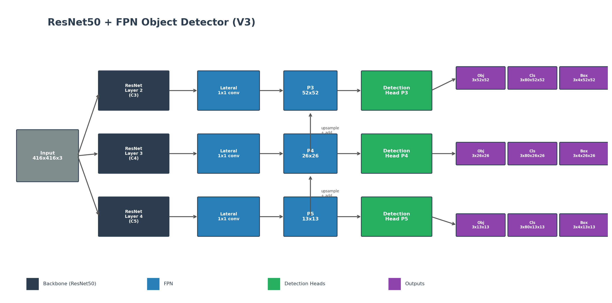
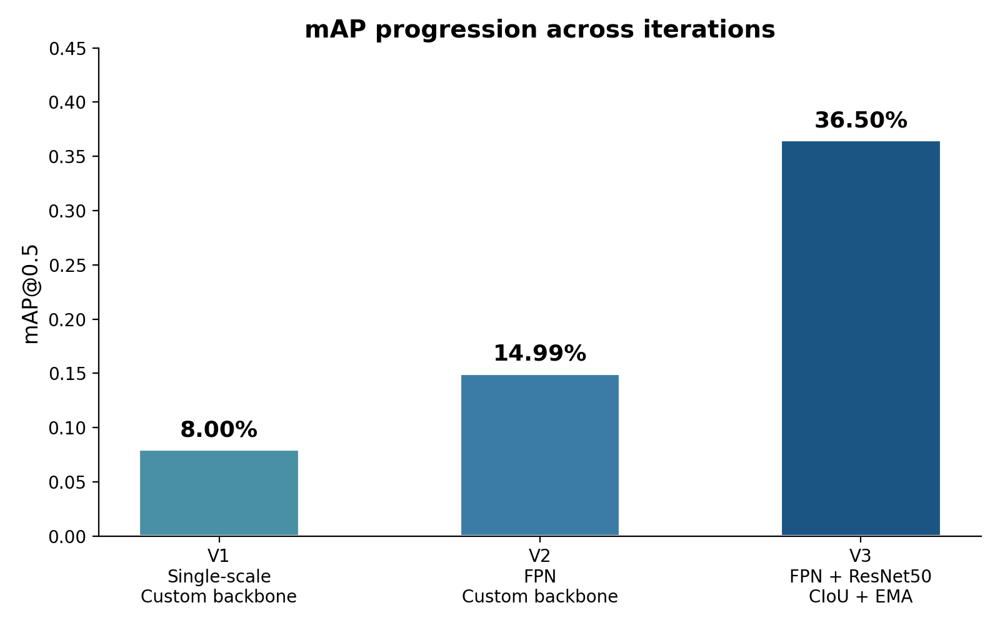
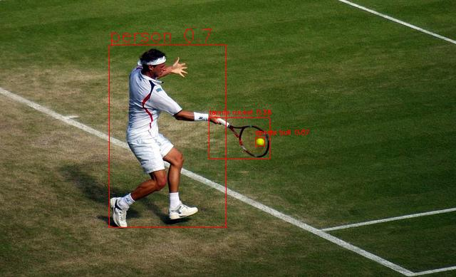
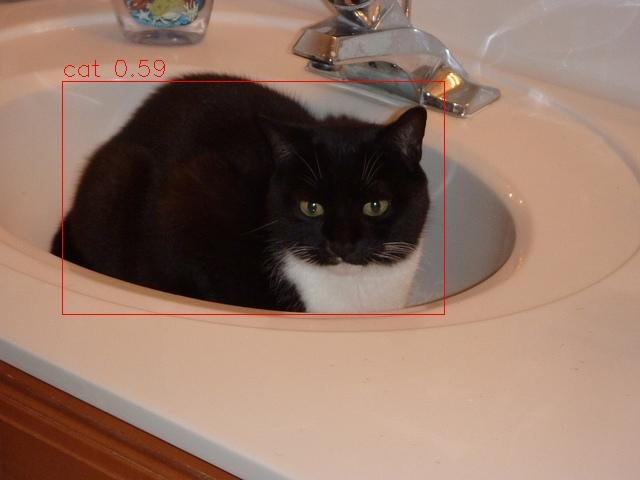
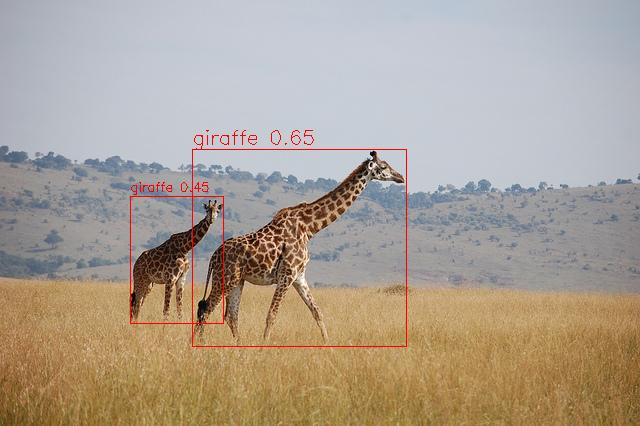
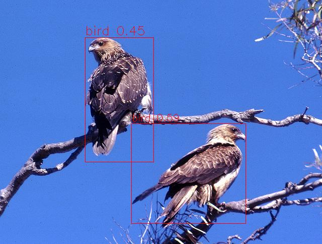

# Object Detection from Scratch — COCO 2017

An iterative journey building an object detector from scratch, progressively incorporating modern deep learning techniques to improve performance on the COCO 2017 dataset.

**Final result: 0.365 mAP@0.5** with a ResNet50-FPN detector trained on the full COCO 2017 training set.



## Motivation

This project was built as a hands-on learning exercise to deeply understand how object detection works — not by using an off-the-shelf model, but by implementing everything from the ground up: dataset loading, target encoding, model architecture, loss functions, training loop, metrics computation, and inference.

The approach was iterative: start simple, measure, identify bottlenecks, and improve. Each version builds on the previous one by introducing specific techniques and measuring their impact.

## Results



| | V1 | V2 | V3 |
|---|---|---|---|
| **Backbone** | Custom (5 blocs Conv+BN) | ResNet50 (pretrained) | ResNet50 (pretrained) |
| **Neck** | — | FPN | FPN |
| **Input** | 224x224 | 224x224 | 416x416 |
| **Grid** | 7x7 | 28x28 / 14x14 / 7x7 | 52x52 / 26x26 / 13x13 |
| **Anchors** | No | No (area-based assignment) | Yes (9 anchors, k-means) |
| **Box regression** | dx, dy, dw, dh | dx, dy, dw, dh | tx, ty, tw, th (log-space) |
| **Obj loss** | BCE | BCE | Focal loss |
| **Box loss** | Smooth L1 | Smooth L1 | CIoU |
| **Class loss** | BCE | BCE | BCE + label smoothing |
| **Augmentations** | Flip, color jitter | Flip, color jitter | Mosaic, flip, color jitter |
| **Optimizer** | Adam | Adam | AdamW |
| **Scheduler** | ReduceLROnPlateau | ReduceLROnPlateau | OneCycleLR |
| **EMA** | No | No | Yes (decay 0.9999) |
| **Mixed precision** | No | No | Yes |
| **mAP@0.5** | 0.08 | 0.15 | 0.365 |

### Sample Predictions (V3)

<p>
  
  
</p>
<p>
  
  
</p>

## Project Structure

```
├── v1/                     # Single-scale detector, custom backbone
│   ├── model.py            # Backbone + detection head + loss
│   ├── coco_dataset.py     # Dataset with 7x7 grid encoding
│   ├── train.py            # Training loop
│   └── metrics.py          # mAP computation
│
├── v2/                     # Multi-scale FPN, custom backbone
│   ├── model.py            # FPN + 3 detection heads + loss
│   ├── coco_dataset.py     # Dataset with area-based scale assignment
│   ├── train.py            # Training loop with checkpoint resume
│   └── metrics.py          # Multi-scale mAP
│
├── v3/                     # ResNet50 + FPN + modern techniques
│   ├── model.py            # ResNet50 backbone, FPN, focal loss, CIoU
│   ├── coco_dataset.py     # Dataset with anchor-based assignment, mosaic
│   ├── train.py            # Training with EMA, mixed precision, wandb
│   ├── metrics.py          # Vectorized mAP with torchvision NMS
│   └── config.py           # Anchor definitions
│
├── tools/
│   ├── anchors.py              # K-means anchor computation on COCO
│   ├── filter_annot.py         # Filter annotations to match available images
│   ├── train_test_split.py     # Split dataset into train/val
│   └── visualize_annot.py      # Visualize ground truth annotations
│
├── inference.py            # Run predictions on any image
└── requirements.txt
```

## What Each Version Introduced

### V1 — Baseline single-scale detector

A minimal detector directly inspired by the [YOLOv1 paper](https://arxiv.org/abs/1506.02640). A custom 5-block CNN backbone outputs a 7x7 feature map, with three parallel 1x1 conv heads predicting objectness, class, and bounding box offsets. The input is 224x224, and each cell is responsible for detecting at most one object.

This version served as a proof of concept to validate the full pipeline: dataset encoding, loss computation, training loop, and mAP evaluation.

### V2 — Feature Pyramid Network

Inspired by the multi-scale detection approach used in [YOLOv5](https://github.com/ultralytics/yolov5) and later YOLO versions. The backbone now outputs feature maps at three resolutions (C3, C4, C5), connected through an FPN with lateral connections and top-down upsampling. Each scale has its own detection head, allowing small objects to be detected on higher-resolution feature maps and large objects on lower-resolution ones. Scale assignment is based on object area.

### V3 — Modern training recipe

Borrowing heavily from the training recipes of [YOLOv5](https://github.com/ultralytics/yolov5) and [YOLOv8](https://github.com/ultralytics/ultralytics): the backbone is replaced by a pretrained ResNet50, which brings better feature extraction from ImageNet pretraining. The input resolution is increased to 416x416 with anchor-based target assignment (9 anchors computed via k-means on COCO).

The loss function is upgraded to focal loss for objectness (handling class imbalance), CIoU for box regression (better gradient signal than Smooth L1), and label smoothing on classification. Training uses AdamW with OneCycleLR scheduling, mixed precision (FP16), exponential moving average of weights, and gradient clipping.

Data augmentation is extended with mosaic (4 images composited into one), which increases object density per training sample and acts as a regularizer.

## Usage

### Requirements

```bash
pip install -r requirements.txt
```

Optional: install `wandb` for experiment tracking during training.

### Inference

```bash
python inference.py --image path/to/image.jpg --checkpoint best_model.pt --output result.jpg --conf 0.4
```

### Training

Training was performed on Google Colab with a T4 GPU. To train V3:

```bash
cd v3
python train.py
```

Dataset paths are configured in the `__main__` block of `train.py`. The training script expects COCO 2017 annotations and images in the paths specified there.

### Anchor Computation

To recompute anchors on a different dataset:

```bash
python tools/anchors.py
```

## Key Takeaways

The biggest single improvement came from switching to a pretrained backbone (+0.13 mAP). This makes sense — learning low-level features from scratch on a detection task is inefficient compared to leveraging features already learned on ImageNet.

The second most impactful change was the combination of CIoU loss and anchor-based assignment, which significantly improved localization quality. Focal loss helped with the extreme foreground/background imbalance inherent to dense detection grids.

Mosaic augmentation and EMA provided smaller but consistent gains, especially in reducing overfitting and stabilizing training.

## Acknowledgements

- [YOLOv1](https://arxiv.org/abs/1506.02640) — Redmon et al., the original paper that inspired the V1 architecture
- [YOLOv5](https://github.com/ultralytics/yolov5) and [YOLOv8](https://github.com/ultralytics/ultralytics) — Ultralytics, for the training techniques adopted in V2 and V3 (mosaic, anchor assignment, EMA, training recipe)
- [COCO Dataset](https://cocodataset.org/) for the images and annotations
- [PyTorch](https://pytorch.org/) and [torchvision](https://pytorch.org/vision/) for the framework and pretrained ResNet50
- [Albumentations](https://albumentations.ai/) for the augmentation pipeline